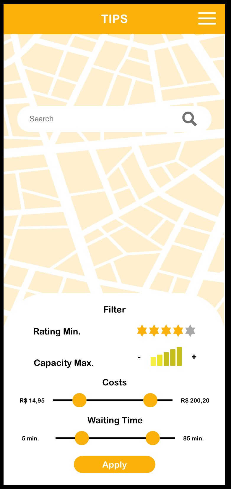
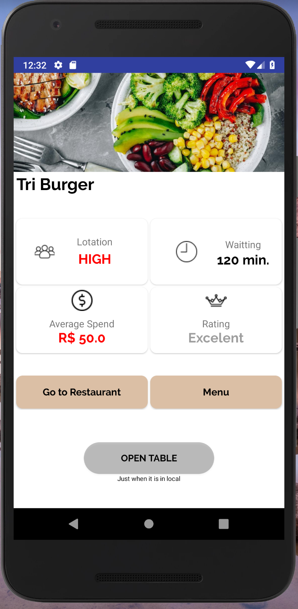

# Tips

A mobile platform to connect you with your favorite restaurants. In this app, you can found the restaurants most next to you and filter them by price, capacity, waiting time, etc. Also, you can book and notification the restaurant that you have going there. In the restaurant, you can open a table, make orders, view the menu, and pay your bill.

## Prototype

Was created a prototype in Adobe XD to screen design. Bellow has six prototype screens:

1. Login
2. Create User
3. Map
4. Filter Screen
5. Promotion Screen
6. Restaurant

<div>
    
    
    
</div>
<div>
    
    
    
</div>

## Develpment

The project was created with follow technologies and versions:

```bash
Kotlin Version: 1.3.30
Gradle Version: 4.0.0
```

About the project, we have the following screens (Remembering that's screens don't copy the prototype perfectly because we are in experience user validation tests yet):

<div>
    
    
    
</div>
<div>
    
    
    
    
</div>